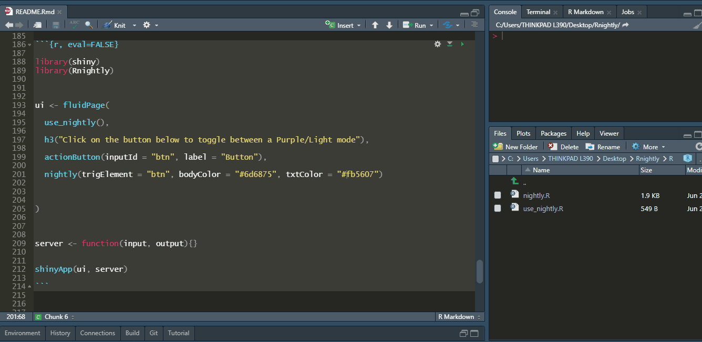

<!-- README.md is generated from README.Rmd. Please edit that file -->

# Rnightly

<!-- badges: start -->

<!-- badges: end -->

The goal of `Rnightly` is to implement a Dark/Light toggle mode in your
Shiny user interface. You can also change the default behavior by
specifying other colors.


## Installation

You can install the development version of `Rnightly` from Github with :

``` r
# install.packages("remotes")

remotes::install_github("feddelegrand7/Rnightly")
```

The `Rnightly` package has two functions:

  - `use_nightly()`: set this function anywhere within your ui. It
    activates the
    [nightly](https://github.com/Fcmam5/nightly.js?utm_campaign=The%20Stash&utm_medium=email&utm_source=Revue%20newsletter)
    JavaScript library. The function must be run only once.

  - `nightly()`: activates the dark/light toggle mode. Look below for
    examples on how to use it.

## Examples

Let’s create a basic shiny app that demonstrates the features of
`Rnightly`. Here the `trigElement` will determine which shiny element
will trigger the Dark/Light mode. Note that it’s the only mandatory
argument:

``` r

library(shiny)
library(Rnightly)


ui <- fluidPage(
  
  use_nightly(), # Activating nightlyjs
  
  h3("Click on the button below to toggle between a Dark/Light mode"), 
  
  actionButton(inputId = "btn", label = "Button"), 
  
  nightly(trigElement = "btn") # Make sure to provide the same id

)


server <- function(input, output){}


shinyApp(ui, server)
```


You can specify any Shiny element to toggle your Dark/Light mode, maybe
a plot ?

``` r

library(shiny)
library(Rnightly)


ui <- fluidPage(
  
  use_nightly(), # Activating nightlyjs
  
  h3("Click on the Plot to toggle between a Dark/Light mode"), 
  
  plotOutput(outputId = "plt"), 
  
  nightly(trigElement = "plt") 

)


server <- function(input, output){
  
  
output$plt <- renderPlot({
  
  
  plot(mtcars)
  
})  
  
  
}


shinyApp(ui, server)
```


Now the cool part. Instead of Dark, using the `bodyColor` argument you
can change the color that will be displayed when toggling:

``` r

library(shiny)
library(Rnightly)


ui <- fluidPage(
  
  use_nightly(), 
  
  h3("Click on the button below to toggle between a Purple/Light mode"), 
  
  actionButton(inputId = "btn", label = "Button"), 
  
  nightly(trigElement = "btn", bodyColor = "#6d6875") 
  
)


server <- function(input, output){}


shinyApp(ui, server)
```


You can also change the text color when toggling :

``` r

library(shiny)
library(Rnightly)


ui <- fluidPage(
  
  use_nightly(), 
  
  h3("Click on the button below to toggle between a Purple/Light mode"), 
  
  actionButton(inputId = "btn", label = "Button"), 
  
  nightly(trigElement = "btn", bodyColor = "#6d6875", txtColor = "#fb5607") 
  
)


server <- function(input, output){}


shinyApp(ui, server)
```



Further, you can set the Shiny inputs’ text color that will be displayed
after toggling :

``` r

library(shiny)
library(Rnightly)


ui <- fluidPage(
  
  use_nightly(), 
  
  h3("Click on the button below to toggle between a Purple/Light mode"), 
  
  actionButton(inputId = "btn", label = "Button"),
  
  br(), br(), br(), 
  
  textInput(inputId = "txt1", label = "Type some text here"),
  
  nightly(trigElement = "btn", 
          bodyColor = "#6d6875", 
          txtColor = "#fb5607", 
          inpTxtColor = "lightblue") 
  
)


server <- function(input, output){}


shinyApp(ui, server)
```


Finally, you can change the background color of Shiny inputs:

``` r

library(shiny)
library(Rnightly)


ui <- fluidPage(
  
  use_nightly(), 
  
  h3("Click on the button below to toggle between a Purple/Light mode"), 
  
  actionButton(inputId = "btn", label = "Button"),
  
  br(), br(), br(), 
  
  textInput(inputId = "txt1", label = "Type some text here"),
  
  nightly(trigElement = "btn", 
          bodyColor = "#6d6875", 
          txtColor = "#fb5607", 
          inpTxtColor = "lightblue", 
          inpBgColor = "#f07167") 

)


server <- function(input, output){}


shinyApp(ui, server)
```


## Code of Conduct

Please note that the Rnightly project is released with a [Contributor
Code of
Conduct](https://contributor-covenant.org/version/2/0/CODE_OF_CONDUCT.html).
By contributing to this project, you agree to abide by its terms.
